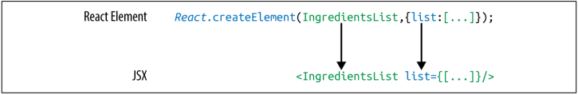

## React with JSX
### React Elements as JSX
- Facebook’s React team released JSX when they released React to provide a concise
syntax for creating complex DOM trees with attributes. They also hoped to make
React more readable, like HTML and XML.
In JSX, an element’s type is specified with a tag. The tag’s attributes represent the
properties. The element’s children can be added between the opening and closing
tags.


### JSX Tips
#### Nested components
- *IngredientsList with three nested Ingredient components*
``` html
<IngredientsList>
  <Ingredient />
  <Ingredient />
  <Ingredient />
</IngredientsList>
```

#### className
- Since class is a reserved word in JavaScript, className is used to define the class
attribute instead:
``` html
<h1 className="fancy">Baked Salmon</h1>
```

#### JavaScript expressions
- JavaScript expressions are wrapped in curly braces and indicate where variables shall
be evaluated and their resulting values returned.
``` html
<h1>{this.props.title}</h1>
<input type="checkbox" defaultChecked={false} />
```

#### Evaluation
- The JavaScript that is added in between the curly braces will get evaluated. 
``` javascript
<h1>{"Hello" + this.props.title}</h1>

<h1>{this.props.title.toLowerCase().replace}</h1>

function appendTitle({this.props.title}) {
  console.log(`${this.props.title} is great!`)
}
```

#### Mapping arrays to JSX
- JSX is JavaScript, so you can incorporate JSX directly inside of JavaScript functions.
- *Array.map() with JSX*
``` javascript
<ul>
  {this.props.ingredients.map((ingredient, i) =>
    <li key={i}>{ingredient}</li>
  )}
</ul>
```

### Babel
- Most software languages allow you to compile your source code. JavaScript is an
interpreted language: the browser interprets the code as text, so there is no need to
compile JavaScript. However, not all browsers support the latest ES6 and ES7 syntax,
and no browser supports JSX syntax. Since we want to use the latest features of Java‐
Script along with JSX, we are going to need a way to convert our fancy source code
into something that the browser can interpret. This process is called transpiling, and
it is what Babel is designed to do.
- *Including babel-core*
``` html
<!DOCTYPE html>
<html>
  <head>
    <meta charset="utf-8">
    <title>React Examples</title>
  </head>
  <body>
    <div class="react-container"></div>
    <!-- React Library & React DOM -->
    <script src="https://unpkg.com/react@15.4.2/dist/react.js"></script>
    <script src="https://unpkg.com/react-dom@15.4.2/dist/react-dom.js"></script>
    <script
    src="https://cdnjs.cloudflare.com/ajax/libs/babel-core/5.8.29/browser.js">
    </script>
    <script type="text/babel">
    // JSX code here. Or link to separate JavaScript file that contains JSX.
    </script>
  </body>
</html>
```

### Recipes as JSX
- One of the reasons that we have grown to love React is that it allows us to write web
applications with beautiful code. It is extremely rewarding to create beautifully writ‐
ten modules that clearly communicate how the application functions. JSX provides us
with a nice, clean way to express React elements in our code that makes sense to us
and is immediately readable by the engineers that make up our community. The
drawback of JSX is that it is not readable by the browser. Before our code can be
interpreted by the browser, it needs to be converted from JSX into pure React.

- *Finished code for recipe app*
``` javascript
var data = [
  {
    "name": "Baked Salmon",
    "ingredients": [
      { "name": "Salmon", "amount": 1, "measurement": "l lb" },
      { "name": "Pine Nuts", "amount": 1, "measurement": "cup" },
      { "name": "Butter Lettuce", "amount": 2, "measurement": "cups" },
      { "name": "Yellow Squash", "amount": 1, "measurement": "med" },
      { "name": "Olive Oil", "amount": 0.5, "measurement": "cup" },
      { "name": "Garlic", "amount": 3, "measurement": "cloves" }
    ],
    "steps": [
      "Preheat the oven to 350 degrees.",
      "Spread the olive oil around a glass baking dish.",
      "Add the salmon, garlic, and pine nuts to the dish.",
      "Bake for 15 minutes.",
      "Add the yellow squash and put back in the oven for 30 mins.",
      "Remove from oven and let cool for 15 minutes. Add the lettuce and serve."
    ]
    ,
    {
    "name": "Fish Tacos",
    "ingredients": [
      { "name": "Whitefish", "amount": 1, "measurement": "l lb" },
      { "name": "Cheese", "amount": 1, "measurement": "cup" },
      { "name": "Iceberg Lettuce", "amount": 2, "measurement": "cups" },
      { "name": "Tomatoes", "amount": 2, "measurement": "large"},
      { "name": "Tortillas", "amount": 3, "measurement": "med" }
    ],
    "steps": [
      "Cook the fish on the grill until hot.",
      "Place the fish on the 3 tortillas.",
      "Top them with lettuce, tomatoes, and cheese."
    ]
  }
];

const Recipe = ({ name, ingredients, steps }) =>
  <section id={name.toLowerCase().replace(/ /g, "-")}>
    <h1>{name}</h1>
    <ul className="ingredients">
      {ingredients.map((ingredient, i) =>
        <li key={i}>{ingredient.name}</li>
      )}
    </ul>
    <section className="instructions">
      <h2>Cooking Instructions</h2>
      {steps.map((step, i) =>
        <p key={i}>{step}</p>
      )}
    </section>
  </section>

const Menu = ({ title, recipes }) =>
  <article>
    <header>
      <h1>{title}</h1>
    </header>
    <div className="recipes">
      {recipes.map((recipe, i) =>
        <Recipe key={i} {...recipe} />
      )}
    </div>
  </article>

ReactDOM.render(
  <Menu recipes={data} title="Delicious Recipes" />,
  document.getElementById("react-container")
)
```
> **Babel Presets**  
  babel-preset-env  
  babel-preset-react

### Intro to Webpack
- Once we start working in production with React, there are a lot of questions to consider: How do we want to deal with JSX and ES6+ transformation? How can we manage our dependencies? How can we optimize our images and CSS?  

- Many different tools have emerged to answer these questions, including Browserify,Gulp, and Grunt. Due to its features and widespread adoption by large companies, webpack has also emerged as one of the leading tools for bundling CommonJS modules.  

- Webpack is billed as a module bundler. A module bundler takes all of our different files (JavaScript, LESS, CSS, JSX, ES6, and so on) and turns them into a single file. The two main benefits of modular bundling are modularity and network performance.  

- Modularity will allow you to break down your source code into parts, or modules, that are easier to work with, especially in a team environment.  

- Network performance is gained by only needing to load one dependency in the browser, the bundle. Each script tag makes an HTTP request, and there is a latency penalty for each HTTP request. Bundling all of the dependencies into a single file allows you to load everything with one HTTP request, thereby avoiding additional latency

- Aside from transpiling, webpack also can handle:
  * _Code splitting_
  * _Minifcation_
  * _Feature flagging_
  * _Hot Module Replacement (HMR)_

#### Webpack Loaders
- A loader is a function that handles the transformations that we want to put our code through during the build process. If our application uses ES6, JSX, CoffeeScript, and other languages that can’t be read natively by the browser, we’ll specify the necessary loaders in the webpack.confg.js file to do the work of converting the code into syntax
that can be read natively by the browser.

#### Recipes App with a Webpack Build

