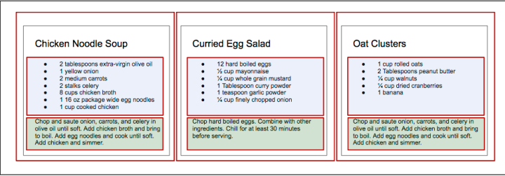

## Page Setup
- In order to work with React in the browser, we need to include two libraries: React and ReactDOM.  
**React** is the library for creating views.  
**ReactDOM** is the library used
to actually render the UI in the browser.

```  HTML document setup with React
<!DOCTYPE html>
<html>
<head>
<meta charset="utf-8">
<title>Pure React Samples</title>
</head>
<body>
  <!-- Target container -->
  <div class="react-container"></div>
  <!-- React library & ReactDOM-->
  <script src="https://unpkg.com/react@15.4.2/dist/react.js"></script>
  <script src="https://unpkg.com/react-dom@15.4.2/dist/react-dom.js"></script>
  <script>
  // Pure React and JavaScript code
</script>
</body>
</html>
```

## The Virtual DOM
- HTML is simply a set of instructions that a browser follows when constructing the
document object model, or DOM. The elements that make up an HTML document
become DOM elements when the browser loads HTML and renders the user interface.

``` html
<section id="baked-salmon">
  <h1>Baked Salmon</h1>
  <ul class="ingredients">
    <li>1 lb Salmon</li>
    <li>1 cup Pine Nuts</li>
    <li>2 cups Butter Lettuce</li>
    <li>1 Yellow Squash</li>
    <li>1/2 cup Olive Oil</li>
    <li>3 cloves of Garlic</li>
  </ul>
  <section class="instructions">
  <h2>Cooking Instructions</h2>
    <p>Preheat the oven to 350 degrees.</p>
    <p>Spread the olive oil around a glass baking dish.</p>
    <p>Add the salmon, garlic, and pine nuts to the dish.</p>
    <p>Bake for 15 minutes.</p>
    <p>Add the yellow squash and put back in the oven for 30 mins.</p>
    <p>Remove from oven and let cool for 15 minutes.
       Add the lettuce and serve.</p>
  </section>
</section>
```

- AJAX SPA
- DOM API 
  + document.createElement
  + document.appendChild

- React is a library that is designed to update the browser DOM for us. We no longer
have to be concerned with the complexities associated with building performant SPAs
because React can do that for us. With React, we do not interact with the DOM API
directly. Instead, we interact with a virtual DOM, or set of instructions that React will
use to construct the UI and interact with the browser.  

- The virtual DOM is made up of React elements, which conceptually seem similar to
HTML elements, but are actually JavaScript objects. It is much faster to work directly
with JavaScript objects than it is to work with the DOM API. We make changes to a
JavaScript object, the virtual DOM, and React renders those changes for us using the
DOM API as efficiently as possible.

## React Elements
- The browser DOM is made up of DOM elements. Similarly, the React DOM is made
up of React elements. DOM elements and React elements may look the same, but
they are actually quite different. A React element is a description of what the actual
DOM element should look like. In other words, React elements are the instructions
for how the browser DOM should be created.

``` javascript
React.createElement("h1", null, "Baked Salmon")
<h1>Baked Salmon</h1>
```

``` javascript
React.createElement("h1", {id: "recipe-0", 'data-type': "title"},"Baked Salmon") 
<h1 data-reactroot id="recipe-0" data-type="title">Baked Salmon</h1>
```

> **data-reactroot** will always appear as an attribute of the root ele‐
ment of your React component. Prior to version 15, React IDs were
added to each node that was a part of your component. This helped
with rendering and keeping track of which elements needed to be
updated. Now, there is only an attribute added to the root, and ren‐
dering is kept track of based on the hierarchy of elements.

``` javascript
{
  $$typeof: Symbol(React.element),
  "type": "h1",
  "key": null,
  "ref": null,
  "props": {"children": "Baked Salmon"},
  "_owner": null,
  "_store": {}
}
```

## ReactDOM
- ReactDOM contains the tools necessary to render React elements in the browser.
ReactDOM is where we will find the render method as well as the **renderToString**
and **renderToStaticMarkup** methods that are used on the server.

``` javascript
var dish = React.createElement("h1", null, "Baked Salmon")
ReactDOM.render(dish, document.getElementById('react-container'))
```

``` html
<body>
  <div id="react-container">
    <h1>Baked Salmon</h1>
  </div>
</body>  
```

## Children
- ReactDOM allows you to render a single element to the DOM.6 React tags this as
data-reactroot. All other React elements are composed into a single element using
nesting.
- React renders child elements using props.children. 

``` html
<ul>
  <li>1 lb Salmon</li>
  <li>1 cup Pine Nuts</li>
  <li>2 cups Butter Lettuce</li>
  <li>1 Yellow Squash</li>
  <li>1/2 cup Olive Oil</li>
  <li>3 cloves of Garlic</li>
</ul>
```
``` javascript
React.createElement(
  "ul",
  null,
  React.createElement("li", null, "1 lb Salmon"),
  React.createElement("li", null, "1 cup Pine Nuts"),
  React.createElement("li", null, "2 cups Butter Lettuce"),
  React.createElement("li", null, "1 Yellow Squash"),
  React.createElement("li", null, "1/2 cup Olive Oil"),
  React.createElement("li", null, "3 cloves of Garlic")
)
```
``` javascript
{
  "type": "ul",
  "props": {
  "children": [
    { "type": "li", "props": { "children": "1 lb Salmon" } … },
    { "type": "li", "props": { "children": "1 cup Pine Nuts"} … },
    { "type": "li", "props": { "children": "2 cups Butter Lettuce" } … },
    { "type": "li", "props": { "children": "1 Yellow Squash"} … },
    { "type": "li", "props": { "children": "1/2 cup Olive Oil"} … },
    { "type": "li", "props": { "children": "3 cloves of Garlic"} … }
    ]
    ...
  }
}
```

> **className in React**  
Any element that has an HTML class attribute is using className
for that property instead of class. Since class is a reserved word
in JavaScript, we have to use className to define the class
attribute of an HTML element.

## Constructing Elements with Data
- The major advantage of using React is its ability to separate data from UI elements.
Since React is just JavaScript, we can add JavaScript logic to help us build the React
component tree. 

``` javascript
React.createElement("ul", {"className": "ingredients"},
  React.createElement("li", null, "1 lb Salmon"),
  React.createElement("li", null, "1 cup Pine Nuts"),
  React.createElement("li", null, "2 cups Butter Lettuce"),
  React.createElement("li", null, "1 Yellow Squash"),
  React.createElement("li", null, "1/2 cup Olive Oil"),
  React.createElement("li", null, "3 cloves of Garlic")
);

var items = [
  "1 lb Salmon",
  "1 cup Pine Nuts",
  "2 cups Butter Lettuce",
  "1 Yellow Squash",
  "1/2 cup Olive Oil",
  "3 cloves of Garlic"
]

React.createElement(
  "ul",
  { className: "ingredients" },
  items.map(ingredient =>
    React.createElement("li", null, ingredient)
)
```

- Adding a key property
``` javascript
React.createElement("ul", {className: "ingredients"},
  items.map((ingredient, i) =>
  React.createElement("li", { key: i }, ingredient)
)
```

## React Components
- In React, we describe each of these parts as a component. Components allow us to
reuse the same DOM structure for different recipes or different sets of data.

- Let’s investigate the three different ways to create components: createClass, ES6
classes, and stateless functional components

### **React.createClass**
- When React was first introduced in 2013, there was only one way to create a compo‐
nent: the createClass function.
React Components | 69New methods of creating components have emerged, but createClass is still used
widely in React projects. The React team has indicated, however, that createClass
may be deprecated in the future.

``` javascript
const IngredientsList = React.createClass({
  displayName: "IngredientsList",
  render() {
    return React.createElement("ul", {"className": "ingredients"},
      React.createElement("li", null, "1 lb Salmon"),
      React.createElement("li", null, "1 cup Pine Nuts"),
      React.createElement("li", null, "2 cups Butter Lettuce"),
      React.createElement("li", null, "1 Yellow Squash"),
      React.createElement("li", null, "1/2 cup Olive Oil"),
      React.createElement("li", null, "3 cloves of Garlic")
      )
  }
})

const list = React.createElement(IngredientsList, null, null)

ReactDOM.render(
  list,
  document.getElementById('react-container')
)
```
``` html
<IngredientsList>
  <ul className="ingredients">
    <li>1 lb Salmon</li>
    <li>1 cup Pine Nuts</li>
    <li>2 cups Butter Lettuce</li>
    <li>1 Yellow Squash</li>
    <li>1/2 cup Olive Oil</li>
    <li>3 cloves of Garlic</li>
  </ul>
</IngredientsList>
```
- Data can be passed to React components as properties. We can create a reusable list of
ingredients by passing that data to the list as an array:
``` javascript
const IngredientsList = React.createClass({
  displayName: "IngredientsList",
  render() {
    return React.createElement("ul", {className: "ingredients"},
      this.props.items.map((ingredient, i) =>
      React.createElement("li", { key: i }, ingredient)
      )
    )
  }
})
const items = [
  "1 lb Salmon",
  "1 cup Pine Nuts",
  "2 cups Butter Lettuce",
  "1 Yellow Squash",
  "1/2 cup Olive Oil",
  "3 cloves of Garlic"
]
ReactDOM.render(
  React.createElement(IngredientsList, {items}, null),
  document.getElementById('react-container')
)
```
``` html
<IngredientsList items=[...]>
  <ul className="ingredients">
    <li key="0">1 lb Salmon</li>
    <li key="1">1 cup Pine Nuts</li>
    <li key="2">2 cups Butter Lettuce</li>
    <li key="3">1 Yellow Squash</li>
    <li key="4">1/2 cup Olive Oil</li>
    <li key="5">3 cloves of Garlic</li>
  </ul>
</IngredientsList>
```
- The components are objects. They can be used to encapsulate code just like classes.
We can create a method that renders a single list item and use that to build out the list
``` javascript
const IngredientsList = React.createClass({
  displayName: "IngredientsList",
  renderListItem(ingredient, i) {
    return React.createElement("li", { key: i }, ingredient)
  },
  render() {
    return React.createElement("ul", {className: "ingredients"},
    this.props.items.map(this.renderListItem)
  )
  }
})
```
- DOM
``` html
<ul data-react-root class="ingredients">
  <li>1 lb Salmon</li>
  <li>1 cup Pine Nuts</li>
  <li>2 cups Butter Lettuce</li>
  <li>1 Yellow Squash</li>
  <li>1/2 cup Olive Oil</li>
  <li>3 cloves of Garlic</li>
</ul>
```

### **React.Component**
- One of the key features included in the ES6 spec is
React.Component, an abstract class that we can use to build new React components.
We can create custom components through inheritance by extending this class with
ES6 syntax.
``` javascript
class IngredientsList extends React.Component {
  renderListItem(ingredient, i) {
    return React.createElement("li", { key: i }, ingredient)
  }
  render() {
    return React.createElement("ul", {className: "ingredients"},
    this.props.items.map(this.renderListItem)
  )
  }
}
```

### **Stateless Functional Components**
- Stateless functional components are functions, not objects; therefore, they do not
have a “this” scope. Because they are simple, pure functions, we’ll use them as much
as possible in our applications. There may come a point where the stateless functional
component isn’t robust enough and we must fall back to using class or
createClass, but in general the more you can use these, the better.

``` javascript
const IngredientsList = props =>
  React.createElement("ul", {className: "ingredients"},
    props.items.map((ingredient, i) =>
      React.createElement("li", { key: i }, ingredient)
  )
)
```
- *Destructuring the properties argument*
``` javascript
const IngredientsList = ({items}) =>
  React.createElement("ul", {className: "ingredients"},
    items.map((ingredient, i) =>
      React.createElement("li", { key: i }, ingredient)
  )
)
```
> **const with Stateless Functional Components**  
Each of these stateless functional components uses const instead of
var when creating a component. This is a common practice but not
a requirement. const declares this function as a constant and pre‐
vents us from redefining that variable later.

## DOM Rendering
- Since we are able to pass data to our components as props, we can separate our appli‐
cation’s data from the logic that is used to create the UI. This gives us an isolated set
of data that is much easier to work with and manipulate than the document object
model. When we change any of the values in this isolated dataset, we change the state
of our application.

- Imagine storing all of the data in your application in a single JavaScript object. Every
time you made a change to this object, you could send it to a component as props and
rerender the UI. This means that ReactDOM.render is going to be doing a lot of heavy
lifting.

- In order for React to work in a reasonable amount of time, ReactDOM.render has to
work smart, and it does. Instead of emptying and reconstructing the entire DOM, ReactDOM.render leaves the current DOM in place and only applies the minimal
amount of changes required to mutate the DOM.

## Factories
- So far, the only way we have created elements has been with React.createElement.
Another way to create a React element is to use factories. A factory is a special object
that can be used to abstract away the details of instantiating objects. In React, we use
factories to help us create React element instances.

- React has built-in factories for all commonly supported HTML and SVG DOM elements, and you can use the React.createFactory function to build your own factories around specific components.

``` html
<h1>Baked Salmon</h1>
```
- *Using createFactory to create an h1*
``` javascript
React.DOM.h1(null, "Baked Salmon")
```
- *Building an unordered list with DOM factories*
``` javascript
React.DOM.ul({"className": "ingredients"},
  React.DOM.li(null, "1 lb Salmon"),
  React.DOM.li(null, "1 cup Pine Nuts"),
  React.DOM.li(null, "2 cups Butter Lettuce"),
  React.DOM.li(null, "1 Yellow Squash"),
  React.DOM.li(null, "1/2 cup Olive Oil"),
  React.DOM.li(null, "3 cloves of Garlic")
)
```
- *Using map with factories*
``` javascript
var items = [
  "1 lb Salmon",
  "1 cup Pine Nuts",
  "2 cups Butter Lettuce",
  "1 Yellow Squash",
  "1/2 cup Olive Oil",
  "3 cloves of Garlic"
]
var list = React.DOM.ul(
  { className: "ingredients" },
  items.map((ingredient, key) =>
    React.DOM.li({key}, ingredient)
  )
)
ReactDOM.render(
  list,
  document.getElementById('react-container')
)
```
### **Using Factories with Components**
- *Creating a factory with IngredientsList*
``` javascript
const { render } = ReactDOM;

const IngredientsList = ({ list }) =>
  React.createElement('ul', null,
    list.map((ingredient, i) =>
      React.createElement('li', {key: i}, ingredient)
    )
  )

const Ingredients = React.createFactory(IngredientsList)

const list = [
  "1 lb Salmon",
  "1 cup Pine Nuts",
  "2 cups Butter Lettuce",
  "1 Yellow Squash",
  "1/2 cup Olive Oil",
  "3 cloves of Garlic"
]

render(
  Ingredients({list}),
  document.getElementById('react-container')
)
```