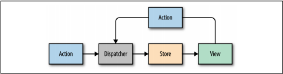

## Enhancing Components
### Component Lifecycles
- The component lifecycle consists of methods that are invoked in series when a com‐
ponent is mounted or updated. These methods are invoked either before or after the
component renders the UI. In fact, the render method itself is a part of the compo‐
nent lifecycle. There are two primary lifecycles: the mounting lifecycle and the updat‐
ing lifecycle.

#### Mounting Lifecycle
- The mounting lifecycle consists of methods that are invoked when a component is
mounted or unmounted. In other words, these methods allow you to initially set up
state, make API calls, start and stop timers, manipulate the rendered DOM, initialize
third-party libraries, and more. These methods allow you to incorporate JavaScript to
assist in the initialization and destruction of a component.

ES6 Class |
----------|
constructor(props)|
componentWillMount()|
render()|
componentDidMount()|
componentWillUnmount()|

- Let’s use the componentWillMount method to initialize a request for some members.
When we get a successful response, we will update the state. Remember the
getFakeMembers promise that we created in Chapter 2? We will use that to load a
random list of members from randomuser.me:
``` javascript
const getFakeMembers = count => new Promise((resolves, rejects) => {
    const api = `https://api.randomuser.me/?nat=US&results=${count}`
    const request = new XMLHttpRequest()
    request.open('GET', api)
    request.onload = () => (request.status == 200) ?
        resolves(JSON.parse(request.response).results) :
        reject(Error(request.statusText))
    request.onerror = err => rejects(err)
    request.send()
})
```
- We will use this promise in the componentWillMount method in a MemberList com‐
ponent. This component will use a Member component to display each user’s picture,
name, email address, and location:
``` javascript
const Member = ({ email, picture, name, location }) =>
    <div className="member">
        
        <h1>{name.first} {name.last}</h1>
        <p><a href={"mailto:" + email}>{email}</a></p>
        <p>{location.city}, {location.state}</p>
    </div>

class MemberList extends Component {
    constructor() {
        super()
        this.state = {
            members: [],
            loading: false,
            error: null
        }
    }

    componentWillMount() {
        this.setState({ loading: true })
        getFakeMembers(this.props.count).then(
            members => {
                this.setState({ members, loading: false })
            },
            error => {
                this.setState({ error, loading: false })
            }
        )
    }

    componentWillUpdate() {
        console.log('updating lifecycle')
    }

    render() {
        const { members, loading, error } = this.state
        return (
            <div className="member-list">
                {(loading) ?
                    <span>Loading Members</span> :
                    (members.length) ?
                        members.map((user, i) =>
                            <Member key={i} {...user} />
                        ) :
                        <span>0 members loaded...</span>
                }
                {(error) ? <p>Error Loading Members: error</p> : ""}
            </div>
        )
    }
}
```
- Initially, when the component is mounted, MemberList has an empty array for mem
bers and loading is false. In the componentWillMount method, the state is changed
to reflect the fact that a request was made to load some users. Next, while waiting for
the request to complete, the component is rendered. Because loading is now true, a
message will be displayed alerting the user to the latency. When the promise passes or
fails, the loading state is returned to false and either the members have been loaded
or an error has been returned. Calling setState at this point will rerender our UI
with either some members or an error.
- The other methods of the component mounting lifecycle include componentDidMount
and componentWillUnmount. componentDidMount is invoked just after the component
has rendered, and componentWillUnmount is invoked just before the component is
unmounted.
- componentDidMount is another good place to make API requests. This method is
invoked after the component has rendered, so any setState calls from this method
will kick off the updating lifecycle and rerender the component.
- componentDidMount is also a good place to initialize any third-party JavaScript that
requires a DOM. For instance, you may want to incorporate a drag-and-drop library
or a library that handles touch events. Typically, these libraries require a DOM before
they can be initialized.
- Another good use for componentDidMount is to start background processes like inter‐
vals or timers. Any processes started in componentDidMount or componentWillMount
can be cleaned up in componentWillUnmount. You don’t want to leave background
processes running when they are not needed.

#### Updating Lifecycle
- The updating lifecycle is a series of methods that are invoked when a component’s
state changes or when new properties are received from the parent. This lifecycle can
be used to incorporate JavaScript before the component updates or to interact with
the DOM after the update. Additionally, it can be used to improve the performance of
an application because it gives you the ability to cancel unnecessary updates.
- The updating lifecycle kicks off every time setState is called. Calling setState
within the updating lifecycle will cause an infinite recursive loop that results in a
stack overflow error. Therefore, setState can only be called in componentWillRecei
veProps, which allows the component to update state when its properties are upda‐
ted.
The updating lifecycle methods include:

- **componentWillReceiveProps(nextProps)**
  - Only invoked if new properties have been passed to the component. This is the
    only method where setState can be called.
- **shouldComponentUpdate(nextProps, nextState)**
  - The update lifecycle’s gatekeeper—a predicate that can call off the update. This
    method can be used to improve performance by only allowing necessary updates.
- **componentWillUpdate(nextProps, nextState)**
  - Invoked just before the component updates. Similar to componentWillMount,
    only it is invoked before each update occurs.
- **componentDidUpdate(prevProps, prevState)**
  - Invoked just after the update takes place, after the call to render. Similar to       componentDidMount, but it is invoked after each update.

- Let’s modify the color organizer application that we created in the last chapter. Specif‐
ically, we’ll add some updating lifecycle functions to the Color component that will
allow us to see how the updating lifecycle works. Let’s assume that we already have
four colors in the state array: Ocean Blue, Tomato, Lawn, and Party Pink. First, we
will use the componentWillMount method to initialize color objects with a style, and
set all four Color elements to have grey backgrounds:
``` javascript
import { Star, StarRating } from '../components'
export class Color extends Component {

    componentWillMount() {
        this.style = { backgroundColor: "#CCC" }
    }

    shouldComponentUpdate(nextProps) {
        const { rating } = this.props
        return rating !== nextProps.rating
    }

    componentWillUpdate(nextProps) {
        const { title, rating } = this.props
        this.style = null
        this.refs.title.style.backgroundColor = "red"
        this.refs.title.style.color = "white"
        alert(`${title}: rating ${rating} -> ${nextProps.rating}`)
    }

    componentDidUpdate(prevProps) {
        const { title, rating } = this.props
        const status = (rating > prevProps.rating) ? 'better' : 'worse'
        console.log(`${title} is getting ${status}`)
    }

    render() {
        const { title, rating, color, onRate } = this.props
        return
        <section className="color" style={this.style}>
            <h1 ref="title">{title}</h1>
            <div className="color"
                style={{ backgroundColor: color }}>
            </div>
            <StarRating starsSelected={rating}
                onRate={onRate} />
        </section>
    }
}

Color.propTypes = {
    title: PropTypes.string,
    rating: PropTypes.number,
    color: PropTypes.string,
    onRate: PropTypes.func
}

Color.defaultProps = {
    title: undefined,
    rating: 0,
    color: "#000000",
    onRate: f => f
}
```

- *HiddenMessages component*
``` javascript
class HiddenMessages extends Component {
    constructor(props) {
        super(props)
        this.state = {
            messages: [
                "The crow crows after midnight",
                "Bring a watch and dark clothes to the spot",
                "Jericho Jericho Go"
            ],
            showing: -1
        }
    }

    componentWillMount() {
        this.interval = setInterval(() => {
            let { showing, messages } = this.state
            showing = (++showing >= messages.length) ?
                -1 :
                showing
            this.setState({ showing })
        }, 1000)
    }

    componentWillUnmount() {
        clearInterval(this.interval)
    }
    
    render() {
        const { messages, showing } = this.state
        return (
            <div className="hidden-messages">
                {messages.map((message, i) =>
                    <HiddenMessage key={i}
                        hide={(i !== showing)}>
                        {message}
                    </HiddenMessage>
                )}
            </div>
        )
    }
}
```

- *HiddenMessage component*
``` javascript
class HiddenMessage extends Component {
    constructor(props) {
        super(props)
        this.state = {
            hidden: (props.hide) ? props.hide : true
        }
    }

    componentWillReceiveProps(nextProps) {
        this.setState({ hidden: nextProps.hide })
    }

    render() {
        const { children } = this.props
        const { hidden } = this.state
        return (
            <p>
                {(hidden) ?
                    children.replace(/[a-zA-Z0-9]/g, "x") :
                    children
                }
            </p>
        )
    }
}
```

### JavaScript Library Integration
- Frameworks such as Angular and jQuery come with their own tools for accessing
data, rendering the UI, modeling state, handling routing, and more. React, on the
other hand, is simply a library for creating views, so we may need to work with other
JavaScript libraries. If we understand how the lifecycle functions operate, we can
make React play nice with just about any JavaScript library.

#### Making Requests with Fetch
- Fetch is a polyfill created by the WHATWG group that allows us to easily make API
calls using promises. In this section we will introduce isomorphic-fetch, a version of
Fetch that works nicely with React. Let’s install isomorphic-fetch:
```
npm install isomorphic-fetch --save
```

- The component lifecycle functions provide us a place to integrate JavaScript. In this
case, they are where we will make an API call. Components that make API calls have
to handle latency, the delay that the user experiences while waiting for a response. We
can address these issues in our state by including variables that tell the component
whether a request is pending or not.

- In the following example, the CountryList component creates an ordered list of
country names. Once mounted, the component makes an API call and changes the
state to reflect that it is loading data. The loading state remains true until there is a
response from this API call:
``` javascript
import { Component } from 'react'
import { render } from 'react-dom'
import fetch from 'isomorphic-fetch'

class CountryList extends Component {
    constructor(props) {
        super(props)
        this.state = {
            countryNames: [],
            loading: false
        }
    }

    componentDidMount() {
        this.setState({ loading: true })
        fetch('https://restcountries.eu/rest/v1/all')
            .then(response => response.json())
            .then(json => json.map(country => country.name))
            .then(countryNames =>
                this.setState({ countryNames, loading: false })
            )
    }

    render() {
        const { countryNames, loading } = this.state
        return (loading) ?
            <div>Loading Country Names...</div> :
            (!countryNames.length) ?
                <div>No country Names</div> :
                <ul>
                    {countryNames.map(
                        (x, i) => <li key={i}>{x}</li>
                    )}
                </ul>
    }
}

render(
    <CountryList />,
    document.getElementById('react-container')
)
```

### Higher-Order Components
- A higher-order component, or HOC, is a simply a function that takes a React compo‐
nent as an argument and returns another React component. Typically, HOCs wrap
the incoming component with a class that maintains state or has functionality.
Higher-order components are the best way to reuse functionality across React com‐
ponents.
- An HOC allows us to wrap a component with another component. The parent com‐
ponent can hold state or contain functionality that can be passed down to the com‐
posed component as properties. The composed component does not need to know
anything about the implementation of an HOC other than the names of the proper‐
ties and methods that it makes available.
- Take a look at this PeopleList component. It loads random users from an API and
renders a list of member names. While the users are loading, a loading message is dis‐
played. Once they have loaded, they are displayed on the DOM:
``` javascript
import { Component } from 'react'
import { render } from 'react-dom'
import fetch from 'isomorphic-fetch'

class PeopleList extends Component {

    constructor(props) {
        super(props)
        this.state = {
            data: [],
            loaded: false,
            loading: false
        }
    }

    componentWillMount() {
        this.setState({ loading: true })
        fetch('https://randomuser.me/api/?results=10')
            .then(response => response.json())
            .then(obj => obj.results)
            .then(data => this.setState({
                loaded: true,
                loading: false,
                data
            }))
    }

    render() {
        const { data, loading, loaded } = this.state
        return (loading) ?
            <div>Loading...</div> :
            <ol className="people-list">
                {data.map((person, i) => {
                    const { first, last } = person.name
                    return <li key={i}>{first} {last}</li>
                })}
            </ol>
    }
}

render(
    <PeopleList />,
    document.getElementById('react-container')
)
```

``` javascript
import { render } from 'react-dom'

const PeopleList = ({ data }) =>
    <ol className="people-list">
        {data.results.map((person, i) => {
            const { first, last } = person.name
            return <li key={i}>{first} {last}</li>
        })}
    </ol>

const RandomMeUsers = DataComponent(
    PeopleList,
    "https://randomuser.me/api/"
)

render(
    <RandomMeUsers count={10} />,
    document.getElementById('react-container')
)

const DataComponent = (ComposedComponent, url) =>
    class DataComponent extends Component {
        constructor(props) {
            super(props)
            this.state = {
                data: [],
                loading: false,
                loaded: false
            }
        }
        componentWillMount() {
            this.setState({ loading: true })
            fetch(url)
                .then(response => response.json())
                .then(data => this.setState({
                    loaded: true,
                    loading: false,
                    data
                }))
        }
        render() {
            return (
                <div className="data-component">
                    {(this.state.loading) ?
                        <div>Loading...</div> :
                        <ComposedComponent {...this.state} />}
                </div>
            )
        }
    }
```

### Managing State Outside of React
- State management in React is great. We could build a lot of applications using React’s
built-in state management system. However, when our applications get larger, state
becomes a little bit harder for us to wrap our heads around. Keeping state in one
place at the root of your component tree will help make this task easier, but even
then, your application may grow to a point where it makes the most sense to isolate
state data in its own layer, independent of the UI.
One of the benefits of managing state outside of React is that it will reduce the need
for many, if any, class components. If you are not using state, it is easier to keep most
- of your components stateless. You should only need to create a class when you need
lifecycle functions, and even then you can isolate class functionality to HOCs and
keep components that only contain UI stateless. Stateless functional components are
easier to understand and easier to test. They are pure functions, so they fit into
strictly functional applications quite nicely.
- Managing state outside of React could mean a lot of different things. You can use
React with Backbone Models, or with any other MVC library that models state. You
can create your own system for managing state. You can manage state using global
variables or localStorage and plain JavaScript. Managing state outside of React sim‐
ply means not using React state or setState in your applications.

### Flux
- Flux is a design pattern developed at Facebook that was designed to keep data flowing
in one direction. Before Flux was introduced, web development architecture was
dominated by variations of the MVC design pattern. Flux is an alternative to MVC,
an entirely different design pattern that complements the functional approach.
- What does React or Flux have to do with functional JavaScript? For starters, a state‐
less functional component is a pure function. It takes in instructions as props and
returns UI elements. A React class uses state or props as input and also will produce
UI elements. React components are composed into a single component. Immutable
data provides the component with input and output as UI elements are returned:
``` javascript
const Countdown = ({count}) => <h1>{count}</h1>
```
- Flux provides us with a way to architect web applications that complements how
React works. Specifically, Flux provides a way to provide the data that React will use
to create the UI.

- Actions and state data are immutable in Flux. Actions can be dispatched from a view,
or they can come from other sources, typically a web server.
- Every change requires an action. Every action provides the instructions to make the
change. Actions also serve as receipts that tell us what has changed, what data was
used to make the change, and where the action originated. This pattern causes no side
effects. The only thing that can make a change is a store. Stores update the data, views
render those updates in the UI, and actions tell us how and why the changes have
occurred.

#### Flux Implementations
- Flux
  - Facebook’s Flux is the design pattern that we just covered. The Flux library
includes an implementation of a dispatcher.
- Reflux
  - A simplified approach to unidirectional data flow that focuses on actions, stores,
and views.
- Flummox
  - A Flux implementation that allows you to build Flux modules through extending
JavaScript classes.
- Fluxible
  - A Flux framework created by Yahoo for working with isomorphic Flux applica‐
tions. Isomorphic applications will be discussed in Chapter 12.
- Redux
  - A Flux-like library that achieves modularity through functions instead of objects.
- MobX
  - A state management library that uses observables to respond to changes in state.