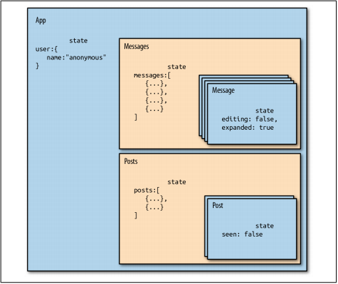
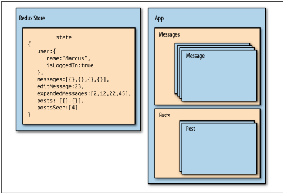
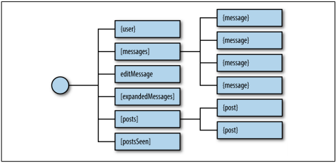

## Redux
- Redux is Flux-like, but it is not exactly Flux. It has actions,
action creators, a store, and action objects that are used to change state. Redux sim‐
plifies the concepts of Flux a bit by removing the dispatcher, and representing appli‐
cation state with a single immutable object. Redux also introduces reducers, which are
not a part of the Flux pattern. Reducers are pure functions that return a new state
based on the current state and an action: (state, action) => newState.

### State
- The idea of storing state in one place isn’t so crazy. In fact, we did it in the last chap‐
ter. We stored it in the root of our application. In pure React or Flux apps, storing
state in as few objects as possible is recommended. In Redux, it’s a rule.

- When you hear that you have to store state in one place, it might seem like an unrea‐
sonable requirement, especially when you have different types of data. Let’s consider
how this can be achieved with an application that has many different types of data.
We’ll look at a social media app that has state spread out across different components
(Figure 8-1). The app itself has user state. All of the messages are stored in state under
that. Each message has its own state, and all of the posts are stored under the posts
component.


- An app structured like this may work well, but as it grows it may be hard to determine the overall state of the application. It may also become cumbersome to understand where updates are coming from, considering that each component will mutate its own state with internal setState calls.

- What messages are expanded? What posts have been read? In order to figure out these details, we must dive into the component tree and track down the state inside of individual components.

- Redux simplifies the way we view state in our application by requiring us to store all state data in a single object. Everything we need to know about the application is in one place: a single source of truth. We could construct the same application with
Redux by moving all of the state data into a single location (see Figure 8-2).


- In the social media app, we can see that we are managing the state of the current user, messages, and posts from the same object: the Redux store. This object even stores information about the message that is being edited, which messages are expanded, and which posts have been seen. This information is captured in arrays containing IDs that reference specific records. All of the messages and posts are cached in this state object, so that data is there.

- With Redux, we pull state management away from React entirely. Redux will manage the state.

- In Figure 8-3, we can see the state tree for the social media app. In it, we have the messages in an array. The same is true for the posts. Everything we need is rooted in one object: the state tree. Each key in this single object represents a branch of the state tree


- When building Redux apps, the first thing you need to think about is state. Try to define it in a single object. It is usually a good idea to draft a JSON sample of your state tree with some placeholder data.

- Let’s go back to our color organizer application. In this application, we’ll have information about each color stored in an array, and information about how the colors should be sorted. A sample of our state data would look like Example 8-1.
``` javascript
{
    colors: [
        {
            "id": "8658c1d0-9eda-4a90-95e1-8001e8eb6036",
            "title": "Ocean Blue",
            "color": "#0070ff",
            "rating": 3,
            "timestamp": "Sat Mar 12 2016 16:12:09 GMT-0800 (PST)"
        },
        {
            "id": "f9005b4e-975e-433d-a646-79df172e1dbb",
            "title": "Tomato",
            "color": "#d10012",
            "rating": 2,
            "timestamp": "Fri Mar 11 2016 12:00:00 GMT-0800 (PST)"
        },
        {
            "id": "58d9caee-6ea6-4d7b-9984-65b145031979",
            "title": "Lawn",
            "color": "#67bf4f",
            "rating": 1,
            "timestamp": "Thu Mar 10 2016 01:11:12 GMT-0800 (PST)"
        },
        {
            "id": "a5685c39-6bdc-4727-9188-6c9a00bf7f95",
            "title": "Party Pink",
            "color": "#ff00f7",
            "rating": 5,
            "timestamp": "Wed Mar 9 2016 03:26:00 GMT-0800 (PST)"
        }
    ],
    sort: "SORTED_BY_DATE"
}
```

### Actions