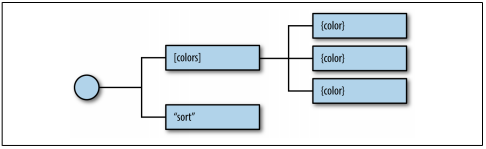
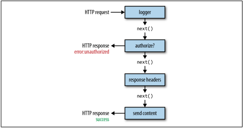
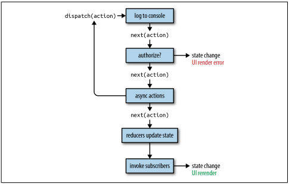

## Redux
- Redux is Flux-like, but it is not exactly Flux. It has actions,
action creators, a store, and action objects that are used to change state. Redux sim‐
plifies the concepts of Flux a bit by removing the dispatcher, and representing appli‐
cation state with a single immutable object. Redux also introduces reducers, which are
not a part of the Flux pattern. Reducers are pure functions that return a new state
based on the current state and an action: (state, action) => newState.

### State
- The idea of storing state in one place isn’t so crazy. In fact, we did it in the last chap‐
ter. We stored it in the root of our application. In pure React or Flux apps, storing
state in as few objects as possible is recommended. In Redux, it’s a rule.

- When you hear that you have to store state in one place, it might seem like an unrea‐
sonable requirement, especially when you have different types of data. Let’s consider
how this can be achieved with an application that has many different types of data.
We’ll look at a social media app that has state spread out across different components
(Figure 8-1). The app itself has user state. All of the messages are stored in state under
that. Each message has its own state, and all of the posts are stored under the posts
component.


- An app structured like this may work well, but as it grows it may be hard to determine the overall state of the application. It may also become cumbersome to understand where updates are coming from, considering that each component will mutate its own state with internal setState calls.

- What messages are expanded? What posts have been read? In order to figure out these details, we must dive into the component tree and track down the state inside of individual components.

- Redux simplifies the way we view state in our application by requiring us to store all state data in a single object. Everything we need to know about the application is in one place: a single source of truth. We could construct the same application with
Redux by moving all of the state data into a single location (see Figure 8-2).


- In the social media app, we can see that we are managing the state of the current user, messages, and posts from the same object: the Redux store. This object even stores information about the message that is being edited, which messages are expanded, and which posts have been seen. This information is captured in arrays containing IDs that reference specific records. All of the messages and posts are cached in this state object, so that data is there.

- With Redux, we pull state management away from React entirely. Redux will manage the state.

- In Figure 8-3, we can see the state tree for the social media app. In it, we have the messages in an array. The same is true for the posts. Everything we need is rooted in one object: the state tree. Each key in this single object represents a branch of the state tree


- When building Redux apps, the first thing you need to think about is state. Try to define it in a single object. It is usually a good idea to draft a JSON sample of your state tree with some placeholder data.

- Let’s go back to our color organizer application. In this application, we’ll have information about each color stored in an array, and information about how the colors should be sorted. A sample of our state data would look like Example 8-1.
``` javascript
{
    colors: [
        {
            "id": "8658c1d0-9eda-4a90-95e1-8001e8eb6036",
            "title": "Ocean Blue",
            "color": "#0070ff",
            "rating": 3,
            "timestamp": "Sat Mar 12 2016 16:12:09 GMT-0800 (PST)"
        },
        {
            "id": "f9005b4e-975e-433d-a646-79df172e1dbb",
            "title": "Tomato",
            "color": "#d10012",
            "rating": 2,
            "timestamp": "Fri Mar 11 2016 12:00:00 GMT-0800 (PST)"
        },
        {
            "id": "58d9caee-6ea6-4d7b-9984-65b145031979",
            "title": "Lawn",
            "color": "#67bf4f",
            "rating": 1,
            "timestamp": "Thu Mar 10 2016 01:11:12 GMT-0800 (PST)"
        },
        {
            "id": "a5685c39-6bdc-4727-9188-6c9a00bf7f95",
            "title": "Party Pink",
            "color": "#ff00f7",
            "rating": 5,
            "timestamp": "Wed Mar 9 2016 03:26:00 GMT-0800 (PST)"
        }
    ],
    sort: "SORTED_BY_DATE"
}
```

### Actions
- In the last section, we introduced an important Redux rule: application state should be stored in a single immutable object. **_Immutable_** means this state object doesn’t change. We will eventually update this state object by replacing it entirely. In order to do this, we will need instructions about what changes. That’s what **_actions_** provide: instructions about what should change in the application state along with the necessary data to make those changes.
- Actions are the only way to update the state of a Redux application. Actions provide us with instructions about what should change, but we can also look at them like receipts about the history of what has changed over time. If users were to remove three colors, add four colors, and then rate five colors, they would leave a trail of information.

- Usually, when we sit down to construct an object-oriented application, we start by identifying the objects, their properties, and how they work together. Our thinking, in this case, is **_noun-oriented_**. When building a Redux application, we want to shift our thinking into being **_verb-oriented_**. How will the actions affect the state data? Once you identify the actions, you can list them in a file called **_constants.js_** (Example 8-2).

_Example 8-2. Constants listed in ./constants.js_
``` javascript
const constants = {
  SORT_COLORS: "SORT_COLORS",
  ADD_COLOR: "ADD_COLOR",
  RATE_COLOR: "RATE_COLOR",
  REMOVE_COLOR: "REMOVE_COLOR"
}
export default constants
```
- In the case of the color organizer, users will need to be able to add a color, rate a color, remove a color, or sort the color list. Here we have defined a string value for each of these action types. An action is a JavaScript object that has at minimum a field for type:
``` javascript
{ type: "ADD_COLOR" }
```
- The action type is a string that defines what should happen. ADD_COLOR is the action that will add a new color to our list of colors in the application state. It is pretty easy to make typos when creating actions using strings:
``` javascript
{ type: "ADD_COLOR" }
```
- This typo would cause a bug in our application. This type of error usually does not trigger any warnings; you simply will not see the expected change of your state data. If you make these errors, they can be tough to find. This is where constants can save you:
``` javascript
import C from "./constants"

{ type: C.ADD_COLOR }
```

### Action Payload Data
- Actions are JavaScript literals that provide the instructions necessary to make a state change. Most state changes also require some data. Which record should I remove? What new information should I provide in a new record? 
- We refer to this data as the action’s payload. For example, when we dispatch an action like RATE_COLOR, we will need to know what color to rate and what rating to apply to that color. This information can be passed directly with the action in the same JavaScript literal (see Example 8-3).

_Example 8-3. RATE_COLOR action_
``` javascript
{
  type: "RATE_COLOR",
  id: "a5685c39-6bdc-4727-9188-6c9a00bf7f95",
  rating: 4
}
```
- Example 8-3 contains the action type, RATE_COLOR, and the data necessary to change
the specified color’s rating to 4.
When we add new colors, we will need details about the color to add (Example 8-4).  

_Example 8-4. ADD_COLOR action_
``` javascript
{
  type: "ADD_COLOR",
  color: "#FFFFFF",
  title: "Bright White",
  rating: 0,
  id: "b5685c39-3bdc-4727-9188-6c9a33df7f52",
  timestamp: "Sat Mar 12 2016 16:12:09 GMT-0800 (PST)"
}
```
- This action tells Redux to add a new color called Bright White to the state. All of the information for the new color is included in the action. Actions are nice little packages that tell Redux how state should be changed. They also include any associated data that Redux will need to make the change.

### Reducers
- Our entire state tree is stored in a single object. A potential complaint might be that it’s not modular enough, possibly because you’re considering modularity as describing objects. Redux achieves modularity via functions. Functions are used to update parts of the state tree. These functions are called reducers.

- Reducers are functions that take the current state along with an action as arguments and use them to create and return a new state. Reducers are designed to update specific parts of the state tree, either leaves or branches. We can then compose reducers into one reducer that can handle updating the entire state of our app given any action.

- The color organizer stores all of the state data in a single tree (see Example 8-5). If we want to use Redux for this app, we can create several reducers that each target specific leaves and branches on our state tree.  

_Example 8-5. Color organizer sample application state_
``` javascript
{
 colors: [
 {
 "id": "8658c1d0-9eda-4a90-95e1-8001e8eb6036",
 "title": "Ocean Blue",
 "color": "#0070ff",
 "rating": 3,
 "timestamp": "Sat Mar 12 2016 16:12:09 GMT-0800 (PST)"
 },
 {
 "id": "f9005b4e-975e-433d-a646-79df172e1dbb",
 "title": "Tomato",
 "color": "#d10012",
 "rating": 2,
 "timestamp": "Fri Mar 11 2016 12:00:00 GMT-0800 (PST)"
 },
 {
 "id": "58d9caee-6ea6-4d7b-9984-65b145031979",
 "title": "Lawn",
 "color": "#67bf4f",
 "rating": 1,
 "timestamp": "Thu Mar 10 2016 01:11:12 GMT-0800 (PST)"
 },
 {
 "id": "a5685c39-6bdc-4727-9188-6c9a00bf7f95",
 "title": "Party Pink",
 "color": "#ff00f7",
 "rating": 5,
 "timestamp": "Wed Mar 9 2016 03:26:00 GMT-0800 (PST)"
 }
 ],
 sort: "SORTED_BY_DATE"
}
```
- This state data has two main branches: colors and sort. The sort branch is a leaf. It doesn’t contain any child nodes. The colors branch stores multiple colors. Each color object represents a leaf (Figure 8-5).


- A separate reducer will be used to handle each part of this state tree. Each reducer is simply a function, so we can stub them all at once with the code in Example 8-6.  

_Example 8-6. Color organizer stubbed reducers_
``` javascript
import C from '../constants'
export const color = (state={}, action) => {
 return {}
}
export const colors = (state=[], action) => {
 return []
}
export const sort = (state="SORTED_BY_DATE", action) => {
 return ""
}
```
- Notice that the color reducer expects state to be an object and returns an object. The colors reducer takes in state as an array and returns an array. The sort reducer takes in a string and returns a string. Each function is focused on a specific part of our state
tree. The returned value and initial state for each function correspond to their data type in the state tree. Colors are being stored in n array. Each color is an object. The sort property is a string.

- Each reducer is designed to handle only the actions necessary to update its part of the state tree. The color reducer will handle only actions that require a new or changed color object: ADD_COLOR and RATE_COLOR. The colors reducer will focus on those actions necessary for managing the colors array: ADD_COLOR, REMOVE_COLOR, RATE_COLOR. Finally, the sort reducer will handle the SORT_COLORS action.

- Each reducer is composed or combined into a single reducer function that will use the store. The colors reducer is composed with the color reducer to manage individual colors within the array. The sort reducer will then be combined with the colors reducer to create a single reducer function. This can update our entire state tree and
handle any action sent to it.

- Both the colors and color reducers will handle ADD_COLOR and RATE_COLOR. But remember, each reducer focuses on a specific part of the state tree. RATE_COLOR in the color reducer will handle the task of changing an individual color’s rating value; RATE_COLOR in the colors reducer will focus on locating the color that needs to be
rated in the array. ADD_COLOR in the color reducer will result in a new color object with the correct properties; ADD_COLOR in the colors reducer will return an array that has an additional color object. They are meant to work together. Each reducer focuses on what a specific action means for its branch in the state tree.

> **Reducer Composition Is Not Required, Just Recommended**

> Redux does not require that we create smaller, more focused reduc‐
ers and compose them into a single reducer. We could create one
reducer function to handle every action in our app. In doing so, we
would lose the benefits of modularity and functional programming.

### The Color Reducer
- Reducers can be coded in a number of different ways. Switch statements are a popular choice because they can process the different types of actions that reducers must handle. The color reducer tests the action.type in a switch statement and then handles
each action type with a switch case:
``` javascript
export const color = (state = {}, action) => {
  switch (action.type) {
    case C.ADD_COLOR:
      return {
        id: action.id,
        title: action.title,
        color: action.color,
        timestamp: action.timestamp,
        rating: 0
      }
    case C.RATE_COLOR:
      return (state.id !== action.id) ?
        state : {
          ...state,
          rating: action.rating
        }
    default:
      return state
  }
}
```
- Here are the actions for the color reducer:
- ADD_COLOR
  - Returns a new color object constructed from the action’s payload data.
- RATE_COLOR
  - Returns a new color object with the desired rating. The ES7 object spread operator allows us to assign the value of the current state to a new object.
- Reducers should always return something. If for some reason this reducer is invoked with an unrecognized action, we will return the current state: the default case.
- Now that we have a color reducer, we can use it to return new colors or rate existing colors. For example:
``` javascript
// Adding a new color
const action = {
 type: "ADD_COLOR",
 id: "4243e1p0-9abl-4e90-95p4-8001l8yf3036",
 color: "#0000FF",
 title: "Big Blue",
 timestamp: "Thu Mar 10 2016 01:11:12 GMT-0800 (PST)"
}
console.log( color({}, action) )
// Console Output
// {
// id: "4243e1p0-9abl-4e90-95p4-8001l8yf3036",
// color: "#0000FF",
// title: "Big Blue",
// timestamp: "Thu Mar 10 2016 01:11:12 GMT-0800 (PST)",
// rating: "0"
// }
```
- The new color object is returned with all fields represented, including the default rating of 0. To change an existing color, we can send the RATE_COLOR action with the ID and new rating:
``` javascript
const existingColor = {
 id: "4243e1p0-9abl-4e90-95p4-8001l8yf3036",
 title: "Big Blue",
 color: "#0000FF",
 timestamp: "Thu Mar 10 2016 01:11:12 GMT-0800 (PST)",
 rating: 0
}
const action = {
 type: "RATE_COLOR",
 id: "4243e1p0-9abl-4e90-95p4-8001l8yf3036",
 rating: 4
}
console.log( color(existingColor, action) )
// Console Output
// {
// id: "4243e1p0-9abl-4e90-95p4-8001l8yf3036",
// title: "Big Blue",
// color: "#0000FF",
// timestamp: "Thu Mar 10 2016 01:11:12 GMT-0800 (PST)",
// rating: 4
// }

```
### The Colors Reducer
- The color reducer is designed to manage leaves on the colors branch of our state tree. The colors reducer will be used to manage the entire colors branch:
``` javascript
export const colors = (state = [], action) => {
  switch (action.type) {
    case C.ADD_COLOR:
      return [
        ...state,
        color({}, action)
      ]
    case C.RATE_COLOR:
      return state.map(
        c => color(c, action)
      )
    case C.REMOVE_COLOR:
      return state.filter(
        c => c.id !== action.id
      )
    default:
      return state
  }
}
```
- The colors reducer will handle any actions for adding, rating, and removing colors.
- ADD_COLOR
  - Creates a new array by concatenating all of the values of the existing state arraywith a new color object. The new color is created by passing a blank state objectand the action to the color reducer.
- RATE_COLOR
  - Returns a new array of colors with the desired color rated. The colors reducer locates the color to be rated within the current state array. It then uses the color reducer to obtain the newly rated color object and replaces it in the array.
- REMOVE_COLOR
  - Creates a new array by filtering out the desired color to remove. The colors reducer is concerned with the array of colors. It uses the color reducer to focus on the individual color objects.

- Now colors can be added, rated, or removed from the colors array with this pure function:
``` javascript
const currentColors = [
 {
 id: "9813e2p4-3abl-2e44-95p4-8001l8yf3036",
 title: "Berry Blue",
 color: "#000066",
 rating: 0,
 timestamp: "Thu Mar 10 2016 01:11:12 GMT-0800 (PST)"
 }
]
const action = {
 type: "ADD_COLOR",
 id: "5523e7p8-3ab2-1e35-95p4-8001l8yf3036",
 title: "Party Pink",
 color: "#F142FF",
 timestamp: "Thu Mar 10 2016 01:11:12 GMT-0800 (PST)"
}
console.log( colors(currentColors, action) )
// Console Output
// [{
// id: "9813e2p4-3abl-2e44-95p4-8001l8yf3036",
// title: "Berry Blue",
// color: "#000066",
// timestamp: "Thu Mar 10 2016 01:11:12 GMT-0800 (PST)",
// rating: 0
// },
// {
// id: "5523e7p8-3ab2-1e35-95p4-8001l8yf3036",
// title: "Party Pink",
// color: "#F142FF",
// timestamp: "Thu Mar 10 2016 01:11:12 GMT-0800 (PST)",
// rating: 0
// }]
``` 

### The Sort Reducer
- The sort reducer is an entire function designed to manage one string variable in our state:
``` javascript
export const sort = (state = "SORTED_BY_DATE", action) => {
  switch (action.type) {
    case C.SORT_COLORS:
      return action.sortBy
    default:
      return state
  }
}
```
- The sort reducer is used to change the sort state variable. It sets the sort state to the value of the action’s sortBy field (if this is not a state provided, it will return SORTED_BY_DATE):
``` javascript
const state = "SORTED_BY_DATE"
const action = {
 type: C.SORT_COLORS,
 sortBy: "SORTED_BY_TITLE"
}
console.log( sort(state, action) ) // "SORTED_BY_TITLE"
```

- To recap, state updates are handled by reducers. Reducers are pure functions that take in state as the first argument and an action as the second argument. Reducers do notcause side effects and should treat their arguments as immutable data. In Redux,modularity is achieved through reducers. Eventually, reducers are combined into a
single reducer, a function that can update the entire state tree.
In this section, we saw how reducers can be composed. We saw how the colors reducer uses the color reducer to assist in color management. 

- In the next section, we will look at how the colors reducer can be combined with the sort reducer to update state.

### The Store
- In Redux, the store is what holds the application’s state data and handles all state updates. While the Flux design pattern allows for many stores that each focus on a specific set of data, Redux only has one store.

- The store handles state updates by passing the current state and action through a single reducer. We will create this single reducer by combining and composing all of our reducers.

- If we create a store using the colors reducer, then our state object will be an array—the array of colors. The getState method of the store will return the present application state. In Example 8-7, we create a store with the color reducer, proving that you can use any reducer to create a store.

_Example 8-7. Store with color reducer_
``` javascript
import { createStore } from 'redux'
import { color } from './reducers'
const store = createStore(color)
console.log( store.getState() ) // {}
```

- In order to create a single reducer tree that looks like Figure 8-6 from the previous section, we must combine the colors and sort reducers. Redux has a function for doing just that, combineReducers, which combines all of the reducers into a single reducer. These reducers are used to build your state tree. The names of the fields
match the names of the reducers that are passed in.

- A store can also be created with initial data. Invoking the colors reducer without state returns an empty array:
``` javascript
import { createStore, combineReducers } from 'redux'
import { colors, sort } from './reducers'
const store = createStore(
  combineReducers({
    colors,
    sort
  })
)
console.log(store.getState())
// Console Output
//{
// colors: [],
// sort: "SORTED_BY_DATE"
//}
```
- In Example 8-8, the store was created with three colors and a sort value of SORTED_BY_TITLE.

_Example 8-8. Initial state data_
``` javascript
import { createStore, combineReducers } from 'redux'
import { colors, sort } from './reducers'
const initialState = {
  colors: [{
      id: "3315e1p5-3abl-0p523-30e4-8001l8yf3036",
      title: "Rad Red",
      color: "#FF0000",
      rating: 3,
      timestamp: "Sat Mar 12 2016 16:12:09 GMT-0800 (PST)"
    },
    {
      id: "3315e1p5-3abl-0p523-30e4-8001l8yf4457",
      title: "Crazy Green",
      color: "#00FF00",
      rating: 0,
      timestamp: "Fri Mar 11 2016 12:00:00 GMT-0800 (PST)"
    },
    {
      id: "3315e1p5-3abl-0p523-30e4-8001l8yf2412",
      title: "Big Blue",
      color: "#0000FF",
      rating: 5,
      timestamp: "Thu Mar 10 2016 01:11:12 GMT-0800 (PST)"
    }
  ],
  sort: "SORTED_BY_TITLE"
}
const store = createStore(
  combineReducers({
    colors,
    sort
  }),
  initialState
)
console.log(store.getState().colors.length) // 3
console.log(store.getState().sort) // "SORTED_BY_TITLE"
```

- The only way to change the state of your application is by dispatching actions through the store. The store has a dispatch method that is ready to take actions as an argument. When you dispatch an action through the store, the action is sent through
the reducers and the state is updated:
``` javascript
console.log(
 "Length of colors array before ADD_COLOR",
 store.getState().colors.length
)
// Length of colors array before ADD_COLOR 3
store.dispatch({
 type: "ADD_COLOR",
 id: "2222e1p5-3abl-0p523-30e4-8001l8yf2222",
 title: "Party Pink",
 color: "#F142FF",
 timestamp: "Thu Mar 10 2016 01:11:12 GMT-0800 (PST)"
})
console.log(
 "Length of colors array after ADD_COLOR",
 store.getState().colors.length
)
// Length of colors array after ADD_COLOR 4
console.log(
 "Color rating before RATE_COLOR",
 store.getState().colors[3].rating
)
// Color rating before RATE_COLOR 0
store.dispatch({
 type: "RATE_COLOR",
 id: "2222e1p5-3abl-0p523-30e4-8001l8yf2222",
 rating: 5
})
console.log(
 "Color rating after RATE_COLOR",
 store.getState().colors[3].rating
)
// Color rating after RATE_COLOR 5
```
- Here, we created a store and dispatched an action that added a new color followed by an action that changed the color’s rating. The console output shows us that dispatching the actions did in fact change our state.
- Originally, we had three colors in the array. We added a color, and now there are four. Our new color had an original rating of zero. Dispatching an action changed it to five. The only way to change data is to dispatch actions to the store.

### Subscribing to Stores
- Stores allow you to subscribe handler functions that are invoked every time the store completes dispatching an action. In the ollowing example, we will log the count of colors in the state:
``` javascript
store.subscribe(() =>
 console.log('color count:', store.getState().colors.length)
)
store.dispatch({
 type: "ADD_COLOR",
 id: "2222e1p5-3abl-0p523-30e4-8001l8yf2222",
 title: "Party Pink",
 color: "#F142FF",
 timestamp: "Thu Mar 10 2016 01:11:12 GMT-0800 (PST)"
})
store.dispatch({
 type: "ADD_COLOR",
 id: "3315e1p5-3abl-0p523-30e4-8001l8yf2412",
 title: "Big Blue",
 color: "#0000FF",
 timestamp: "Thu Mar 10 2016 01:11:12 GMT-0800 (PST)"
})
store.dispatch({
 type: "RATE_COLOR",
 id: "2222e1p5-3abl-0p523-30e4-8001l8yf2222",
 rating: 5
})
store.dispatch({
 type: "REMOVE_COLOR",
 id: "3315e1p5-3abl-0p523-30e4-8001l8yf2412"
})
// Console Output
// color count: 1
// color count: 2
// color count: 2
// color count: 1
```
- Subscribing this listener to the store will log the color count to the console every time we submit an action. In the preceding example we see four logs: the first two for ADD_COLOR, the third for ATE_COLOR, and the fourth for REMOVE_COLOR.
- The store’s subscribe method returns a function that you can use later to unsubscribe the listener:
``` javascript
const logState = () => console.log('next state', store.getState())
const unsubscribeLogger = store.subscribe(logState)
// Invoke when ready to unsubscribe the listener
unsubscribeLogger()
```

### Saving to localStorage
- Using the store’s subscribe function, we will listen for state changes and save those changes to localStorage under the key 'redux-store'. When we create the store we can check to see if any data has been saved under this key and, if so, load that data as
our initial state. With just a few lines of code, we can have persistent state data in the browser:
``` javascript
const store = createStore(
  combineReducers({
    colors,
    sort
  }),
  (localStorage['redux-store']) ?
  JSON.parse(localStorage['redux-store']) : {}
)
store.subscribe(() => {
  localStorage['redux-store'] = JSON.stringify(store.getState())
})
console.log('current color count', store.getState().colors.length)
console.log('current state', store.getState())
store.dispatch({
  type: "ADD_COLOR",
  id: uuid.v4(),
  title: "Party Pink",
  color: "#F142FF",
  timestamp: new Date().toString()
})
```
- Every time we refresh this code, our colors list gets larger by one color. First, within the createStore function call, we see if the redux-store key exists. If it exists, we’ll parse the JSON. If it doesn’t exist, we’ll return an empty object. Next, we subscribe a
listener to the store that saves the store’s state every time an action is dispatched. Refreshing the page would continue to add the same color.

- To recap, stores hold and manage state data in Redux applications, and the only way to change state data is by dispatching actions through the store. The store holds application state as a single object. State mutations are managed through reducers. Stores
are created by supplying a reducer along with optional data for the initial state. Also, we can subscribe listeners to our store (and unsubscribe them later), and they will be invoked every time the store finishes dispatching an action.

### Action Creators
- Action objects are simply JavaScript literals. Action creators are functions that create and return these literals. Let’s consider the following actions:
``` javascript
{
  type: "REMOVE_COLOR",
  id: "3315e1p5-3abl-0p523-30e4-8001l8yf2412"
} 

{
  type: "RATE_COLOR",
  id: "441e0p2-9ab4-0p523-30e4-8001l8yf2412",
  rating: 5
}
```
- We can simplify the logic involved with generating an action by adding an action creators for each of these action types:
``` javascript
import C from './constants'

export const removeColor = id =>
 ({
   type: C.REMOVE_COLOR,
   id
 })
 
export const rateColor = (id, rating) =>
 ({
   type: C.RATE_COLOR,
   id,
   rating
 })
```

- Now whenever we need to dispatch a RATE_COLOR or a REMOVE_COLOR, we can use the action creator and send the necessary data as function arguments:
``` javascript
store.dispatch( removeColor("3315e1p5-3abl-0p523-30e4-8001l8yf2412") )
store.dispatch( rateColor("441e0p2-9ab4-0p523-30e4-8001l8yf2412", 5) )
```
- Action creators simplify the task of dispatching actions; we only need to call a function and send it the necessary data. Action creators can abstract away details of how an action is created, which can greatly simplify the process of creating an action. For example, if we create an action called sortBy, it can decide the appropriate action to take:
``` javascript
import C from './constants'
export const sortColors = sortedBy =>
  (sortedBy === "rating") ?
  ({
    type: C.SORT_COLORS,
    sortBy: "SORTED_BY_RATING"
  }) :
  (sortedBy === "title") ?
  ({
    type: C.SORT_COLORS,
    sortBy: "SORTED_BY_TITLE"
  }) :
  ({
    type: C.SORT_COLORS,
    sortBy: "SORTED_BY_DATE"
  })
```
- The sortColors action creator checks sortedBy for "rating", "title", and the default. Now there is considerably less typing involved whenever you want to dispatch a sortColors action:
``` javascript
store.dispatch( sortColors("title") )
```
- Action creators can have logic. They also can help abstract away unnecessary details when creating an action. For example, take a look at the action for adding a color:
``` javascript
{
 type: "ADD_COLOR",
 id: uuid.v4(),
 title: "Party Pink",
 color: "#F142FF",
 timestamp: new Date().toString()
}
```
- So far, the IDs and timestamps have been generated when the actions are dispatched. Moving this logic into an action creator would abstract the details away from the process of dispatching actions:
``` javascript
import C from './constants'
import { v4 } from 'uuid'
export const addColor = (title, color) =>
  ({
    type: C.ADD_COLOR,
    id: v4(),
    title,
    color,
    timestamp: new Date().toString()
  })
```
- The addColor action creator will generate a unique ID and will provide a timestamp. Now it’s much easier to create new colors—we provide a unique ID by creating a variable that we can increment, and the timestamp is automatically set using the client’s present time:
``` javascript
store.dispatch( addColor("#F142FF", "Party Pink") )
```
- The really nice thing about action creators is that they provide a place to encapsulate all of the logic required to successfully create an action. The addColor action creator handles everything associated with adding new colors, including providing unique IDs and timestamping the action. It is all in one place, which makes debugging our application much easier.

## Middleware
- If you ever used a server-side framework such as Express, Sinatra, Django, KOA, or ASP.NET, then you are probably already familiar with the concept of middleware. (In case you’re not, middleware serves as the glue between two different layers or different pieces of software.)
- Redux also has middleware. It acts on the store’s dispatch pipeline. In Redux, middleware consists of a series of functions that are executed in a row in the process of dispatching an action, as shown in Figure 8-7.

_Figure 8-7. HTTP request middleware pipeline_

- These higher-order functions allow you to insert functionality before or after actions are dispatched and state is updated. Each middleware function is executed sequentially (Figure 8-8).

- Each piece of middleware is a function that has access to the action, a dispatch function, and a function that will call next. next causes the update to occur. Before next is called, you can modify the action. After next, the state will have changed.

_Figure 8-8. Middleware functions execute sequentially_

### Applying Middleware to the Store
- In this section, we are going to create a storeFactory. A factory is a function that manages the process of creating stores. In this case, the factory will create a store that has middleware for logging and saving data. The storeFactory will be one file that contains one function that groups everything needed to create the store. Whenever
we need a store, we can invoke this function:
``` javascript
const store = storeFactory(initialData)
``` 
- When we create the store, we create two pieces of middleware: the logger and the saver (Example 8-9). The data is saved to localStorage with middleware instead of the store method.

_Example 8-9. storeFactory: ./store/index.js_
``` javascript
import {
  createStore,
  combineReducers,
  applyMiddleware
} from 'redux'
import {
  colors,
  sort
} from './reducers'
import stateData from './initialState'

const logger = store => next => action => {
  let result
  console.groupCollapsed("dispatching", action.type)
  console.log('prev state', store.getState())
  console.log('action', action)
  result = next(action)
  console.log('next state', store.getState())
  console.groupEnd()
}

const saver = store => next => action => {
  let result = next(action)
  localStorage['redux-store'] = JSON.stringify(store.getState())
  return result
}
const storeFactory = (initialState = stateData) =>
  applyMiddleware(logger, saver)(createStore)(
    combineReducers({
      colors,
      sort
    }),
    (localStorage['redux-store']) ?
    JSON.parse(localStorage['redux-store']) :
    stateData
  )
  
export default storeFactory
```

- Both the logger and the saver are middleware functions. In Redux, middleware is defined as a higher-order function: it’s a function that returns a function that returns a function. The last function returned is invoked every time an action is dispatched. When this function is invoked, you have access to the action, the store, and the function for sending the action to the next middleware.

- Instead of exporting the store directly, we export a function, a factory that can be used to create stores. If this factory is invoked, then it will create and return a store that incorporates logging and saving.

- In the logger, before the action is dispatched, we open a new console group and log the current state and the current action. Invoking next pipes the action on to the next piece of middleware and eventually the reducers. The state at this point has been updated, so we log the changed state and end the console group.

- In the saver, we invoke next with the action, which will cause the state to change. Then we save the new state in localStorage and return the result, as in Example 8-9.

- In Example 8-10 we create a store instance using the storeFactory. Since we do not send any arguments to this store, the initial state will come from state data.

_Example 8-10. Creating a store using the factory_
``` javascript
import storeFactory from "./store"
const store = storeFactory(true)
store.dispatch( addColor("#FFFFFF","Bright White") )
store.dispatch( addColor("#00FF00","Lawn") )
store.dispatch( addColor("#0000FF","Big Blue") )
```

- Every action dispatched from this store will add a new group of logs to the console, and the new state will be saved in localStorage.
- In this chapter, we looked at all of the key features of Redux: state, actions, reducers, stores, action creators, and middleware. We handled all of the state for our application with Redux, and now we can wire it up to the user interface.
- In the next chapter we will take a look at the react-redux framework, a tool used to efficiently connect our Redux store to the React UI.